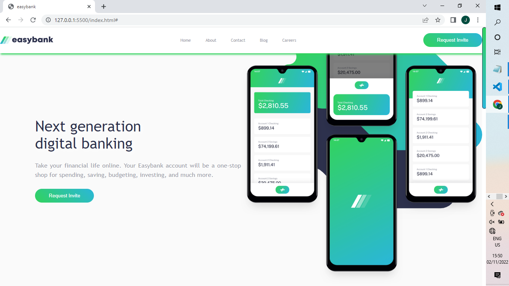

# Frontend Mentor - Easybank landing page solution

### November 2, 2022

This is my solution to the [Easybank landing page challenge on Frontend
Mentor](https://www.frontendmentor.io/challenges/easybank-landing-page-WaUhkoDN). Frontend Mentor challenges help you
improve your coding skills by building realistic projects.

## Table of contents

- [Overview](#overview)
- [The challenge](#the-challenge)
- [Screenshot](#screenshot)
- [Links](#links)
- [My process](#my-process)
- [Built with](#built-with)
- [What I learned](#what-i-learned)
- [Continued development](#continued-development)
- [Useful resources](#useful-resources)
- [Author](#author)

## Overview

### The challenge

Users should be able to:

- View the optimal layout for the site depending on their device's screen size
- See hover states for all interactive elements on the page

### Screenshot



### Links

- Solution URL: [](https://github.com/JoshuaOlubori/Easybank/)
- Live Site URL: [](https://joshuaolubori.github.io/Easybank/)

## My process

### Built with

- Semantic HTML5 markup
- CSS custom properties
- Flexbox
- CSS Grid
- Mobile-first workflow

### What I learned

This project emphasized the importance of proper layout before the addition of styles.
Because of the peculiar arrangement of elements in the designs, I was forced to be deliberate and particular about the
layout
of elements before adding styling. I used a grid with 3 columns for the main page layout. All the content sat in the
middle column;
the outermost 2 columns were used as borders. Using Grid, I was able to add styling even to those borders with empty
divs that are direct children of the grid parent like this:

```html
<div class="lgb-1"></div>
<div class="lgb-2"></div>
```

Heydon Pickering & Andy Bell's book ~Every Layout~ heavily influenced my approach to design. For example, I used a
modular scale for most spacings as espoused in his book to maximize visual harmony

```css
--ratio: 1.5;
--s-10: calc(var(--s-9) / var(--ratio));
--s-9: calc(var(--s-8) / var(--ratio));
--s-8: calc(var(--s-7) / var(--ratio));
--s-7: calc(var(--s-6) / var(--ratio));
--s-6: calc(var(--s-5) / var(--ratio));
--s-5: calc(var(--s-4) / var(--ratio));
--s-4: calc(var(--s-3) / var(--ratio));
--s-3: calc(var(--s-2) / var(--ratio));
--s-2: calc(var(--s-1) / var(--ratio));
--s-1: calc(var(--s0) / var(--ratio));
--s0: 1rem;
--s1: calc(var(--s0) * var(--ratio));
--s2: calc(var(--s1) * var(--ratio));
--s3: calc(var(--s2) * var(--ratio));
--s4: calc(var(--s3) * var(--ratio));
--s5: calc(var(--s4) * var(--ratio));
--s6: calc(var(--s5) * var(--ratio));
--s7: calc(var(--s6) * var(--ratio));

--lineHeight: 1.5;
```

Using components like "stack"

```css
.stack {
  /* ↓ The flex context */
  display: flex;
  flex-direction: column;
  justify-content: flex-start;
}
.stack > * {
  /* ↓ Any extant vertical margins are removed */
  margin-block: 0;
}
.stack > * + * {
  /* ↓ Top margin is only applied to successive elements */
  margin-block-start: var(--space, 1.5rem;);
}
```

..."cluster"

```css
.cluster {
  /* ↓ Set the Flexbox context */
  display: flex;
  /* ↓ Enable wrapping */
  flex-wrap: wrap;
  /* ↓ Set the space/gap */
  gap: var(--space, 1rem);
  /* ↓ Choose your justification (flex-start is default) */
  justify-content: center;
  /* ↓ Choose your alignment (flex-start is default) */
  align-items: center;
}
```

...and more, these components allow for clean placement of elements; not just using FLexbox and Grid improperly but
intentionally with consideration of how each elements padding and margin affects its neighbour

I used a little JavaScript to enable the navigation menu interactivity

```js
const mainMenu = document.querySelector(".mainMenu");
const closeMenu = document.querySelector(".closeMenu");
const openMenu = document.querySelector(".openMenu");

openMenu.addEventListener("click", show);
closeMenu.addEventListener("click", close);

function show() {
  mainMenu.style.display = "flex";
  mainMenu.style.top = "0";
}

function close() {
  mainMenu.style.top = "-100%";
}
```

### Continued development

I would ultimately aim to connect it to a backend, probably Django because I've been working on Django for a while now
and even have a project done with it.

Also, I should employ React going forward.

### Useful resources

- [Every Layout](https://every-layout.dev/) - A comprehensive layout methodology
- [HTML CSS Coding Practice(Practical Hands-on Series 2) (EBISUCOM)](https://ep.ebisu.com/en/) -
  EBISUCOM is a web developer group in Japan. HTML, CSS, WordPress,
  GatsbyJS, and more. They research various media, construct and design
  websites. I really like their emphasis on proper design before actual coding

## Author

- Frontend Mentor - [@JoshuaOlubori](https://www.frontendmentor.io/profile/JoshuaOlubori)
- Twitter - [@joshua_olubori](https://twitter.com/joshua_olubori)

- Linkedin - [@joshua-edun](https://www.linkedin.com/in/joshua-edun/)

- Github - [@JoshuaOlubori](https://www.github.com/JoshuaOlubori)
